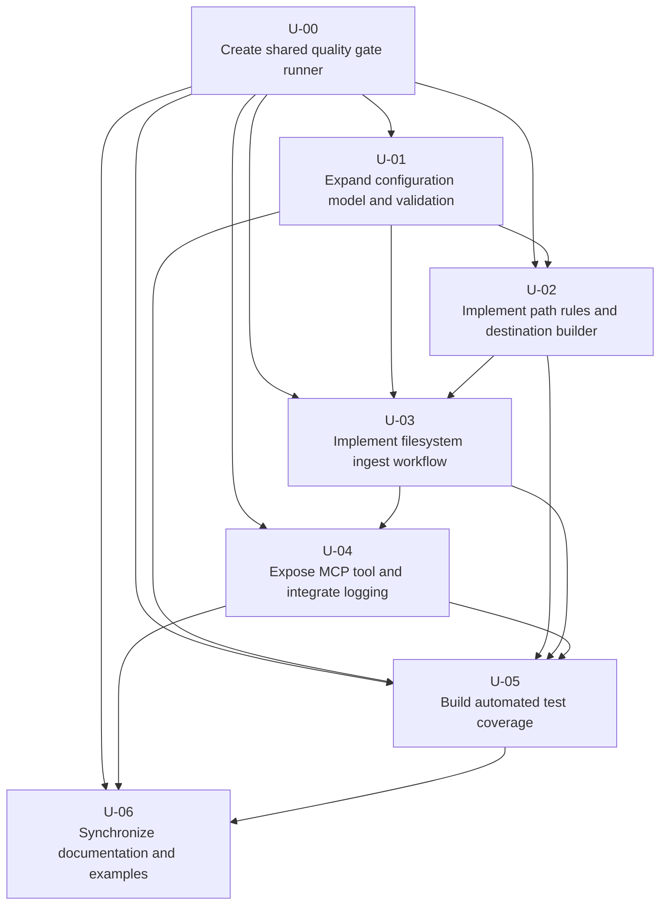

# Work Plan

This is a living implementation work plan for `mcp-media-library-manager`. It breaks the current functional and non-functional requirements into phased units of work sized for iterative implementation and review. Dependencies indicate the units that should be completed first or be available in draft form before the dependent unit is finalized.

## Completion Rule

Every unit of work must include or update unit tests for the behavior introduced or changed by that unit. A unit is not considered complete until its code changes and associated tests are implemented and the shared quality gate runner script created by U-00 has been executed successfully.

## Execution Rule

An LLM coding agent shall work on no more than one unit of work at a time. The agent shall fully complete the selected unit, run the shared quality gate runner from U-00 until it passes, and then stop and inform the user that the unit is complete before starting any other unit. The agent shall not attempt to work through the entire plan in a single prompt or uninterrupted run, because doing so increases context consumption, reduces review opportunities, and raises the risk of compounding errors across multiple units.

## Progress Tracking

Each unit below has a checkbox at the start of its code (e.g., `[ ] U-00`). As units are completed, the checkbox shall be marked: change `[ ]` to `[x]` to indicate the unit is done. This provides a visual progress summary at a glance.

**Code:** [x] U-00
**Title:** Create shared quality gate runner
**Dependencies:** None  
**Description:**
Create a shell script that runs the full project quality gate sequence defined by `.pre-commit-config.yaml` so later units do not need to rediscover or reverse engineer the repository’s validation steps. Place the script in a stable, easy-to-find location such as `scripts/run-quality-gates.sh`, ensure it is executable, and make its interface simple enough for an LLM coding agent to invoke consistently from the repository root. The script should run the relevant quality checks in a deterministic order and fail with a non-zero exit status if any gate fails. Update the README or maintainer-facing workflow notes only if needed so future contributors know this script is the canonical validation entry point. This unit must include or update unit-adjacent coverage if any supporting Python wrapper code is introduced, and it is only complete when the new script itself has been executed successfully against the repository.

**Code:** [x] U-01
**Title:** Expand configuration model and validation
**Dependencies:** U-00  
**Description:**
Update `src/mcp_media_library_manager/config.py` so the typed configuration model includes `source_roots` and `show_roots` in the `[server]` section in addition to the existing `host` and `port`. Make configuration loading fail fast with explicit validation errors when either key is missing, empty, malformed, or unusable. Decide and document one canonical representation in Python, preferably `list[Path]` or `tuple[Path, ...]`, even if the TOML file continues to accept the README’s current comma-separated string style. Normalize root entries during parsing so later units are not forced to parse configuration strings themselves. Keep the configuration layer focused on loading and validating configuration only; it should not perform media operations. Update any related config fixtures or sample config files used by tests. This unit must add or update unit tests covering valid parsing and fail-fast validation cases, and it is only complete when the shared quality gate runner from U-00 passes.

**Code:** [ ] U-02
**Title:** Implement path rules and destination builder
**Dependencies:** U-00, U-01  
**Description:**
Create the pure path-handling logic that turns validated structured metadata into a safe destination path for a TV episode. This work should live outside `server.py` and ideally outside the high-level MCP tool wrapper as well, in a new helper module such as `src/mcp_media_library_manager/pathing.py` or `src/mcp_media_library_manager/library_paths.py`. Implement validation and helper functions for: rejecting show names containing path separator characters such as `/` and `\`; rejecting unsafe characters such as control characters and embedded newlines; enforcing Windows-valid path component rules for generated folder and file names; normalizing generated paths to the documented Linux-style forward-slash structure; and building the exact README destination format `/<show_root>/<show name> (<year first aired>)/Season XX/SXXEXX.mkv`. This unit should also provide helper functions that verify whether a resolved source path is inside a configured source root and whether a resolved destination path is inside a configured show root. Keep these helpers deterministic and side-effect free so they are easy to test directly. This unit must add or update unit tests for destination construction, cross-platform-safe path validation, and root-enforcement helpers, and it is only complete when the shared quality gate runner from U-00 passes.

**Code:** [ ] U-03
**Title:** Implement filesystem ingest workflow
**Dependencies:** U-00, U-01, U-02  
**Description:**
Implement the actual TV episode ingest operation as pure application logic in `src/mcp_media_library_manager/tools.py` or in a new filesystem-oriented helper module invoked by `tools.py`. The operation should accept the structured inputs described by the requirements: source file path, show name, first-air year, season number, and episode number. Validate the supplied source path against configured `source_roots`, compute the destination path using the U-02 helpers, verify the destination remains within a configured `show_root`, create any missing destination directories, and fail with an explicit error if the destination file already exists. The implementation must be safe by default: do not overwrite existing files, do not allow caller-controlled destination paths, and reject ambiguous or invalid inputs instead of guessing. Return a clear structured result that makes success and failure states obvious to MCP callers, including the computed destination path on success and a useful error message on failure. Preserve strict type annotations and keep framework-specific code out of this unit. This unit must add or update unit tests for successful ingest, directory creation, collision failures, and source-root and show-root enforcement, and it is only complete when the shared quality gate runner from U-00 passes.

**Code:** [ ] U-04
**Title:** Expose the ingest operation as an MCP tool and integrate logging
**Dependencies:** U-00, U-03  
**Description:**
Register a new MCP tool in `src/mcp_media_library_manager/server.py` that wraps the ingest workflow from U-03. Follow the existing project pattern where `server.py` contains the FastMCP `@mcp.tool()` registration and delegates real work to typed functions in `tools.py`. Give the tool a clear name and docstring that make the inputs and behavior obvious to an MCP-capable agent. Ensure the server passes the loaded configuration into the ingest logic in a maintainable way rather than relying on ad hoc globals. Add structured logging around tool invocation, success, validation failures, and collision failures using the existing logger factory from `src/mcp_media_library_manager/logging.py`, while keeping logs free of unnecessary noise. The result of this unit should be that an MCP client can call the new tool over the existing `/mcp` endpoint and receive a structured success or failure response. This unit must add or update unit tests covering the MCP wrapper and logging-relevant behavior where practical, and it is only complete when the shared quality gate runner from U-00 passes.

**Code:** [ ] U-05
**Title:** Build automated test coverage for configuration, pathing, and ingest behavior
**Dependencies:** U-00, U-01, U-02, U-03, U-04  
**Description:**
Expand `tests/unit/` so the new behavior is covered with focused automated tests. Add config tests that prove `source_roots` and `show_roots` are parsed correctly and that malformed or missing values fail fast. Add pathing tests for valid destination construction, zero-padded season and episode formatting, rejection of show names with path separator characters, rejection of control characters or embedded newlines, and enforcement that generated components remain Windows-friendly. Add ingest workflow tests using temporary directories to verify successful moves, directory creation, source-root enforcement, show-root enforcement, and collision handling when the destination file already exists. Add at least a light server-level test or equivalent coverage confirming the MCP wrapper delegates to the new tool logic. Keep tests aligned with the architecture described in the README: pure logic should be tested directly without depending on FastMCP where possible. This unit must also verify that the consolidated quality gate runner from U-00 succeeds against the full changed codebase, and it is only complete when that happens cleanly.

**Code:** [ ] U-06
**Title:** Synchronize README, examples, and project scaffolding
**Dependencies:** U-00, U-04, U-05  
**Description:**
Update `README.md` so it accurately reflects the implemented tool set, configuration format, and operational behavior. Add the new tool to the Available Tools table, document its arguments and error conditions, and ensure the configuration section matches the actual accepted config shape for `source_roots` and `show_roots`. Clarify the exact destination path standard, the Windows-friendly path-component rule, the rejection of pathing characters in show names, and the fact that missing destination directories are created automatically. Update `config.toml.example` if present or add it if missing so the sample matches the live parser. Review any maintainer-facing docs referenced by the README if they mention tool-adding workflow or testing commands that should now reflect the new ingest functionality, including use of the shared quality gate runner from U-00 as the canonical validation command. This unit must add or update any unit tests affected by documentation-driven config or example changes where applicable, and it is only complete when the shared quality gate runner from U-00 passes.

